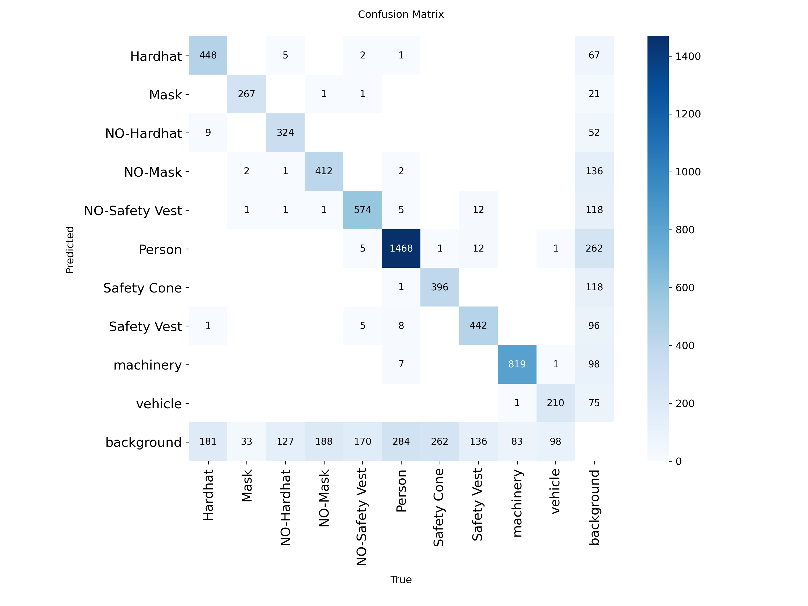
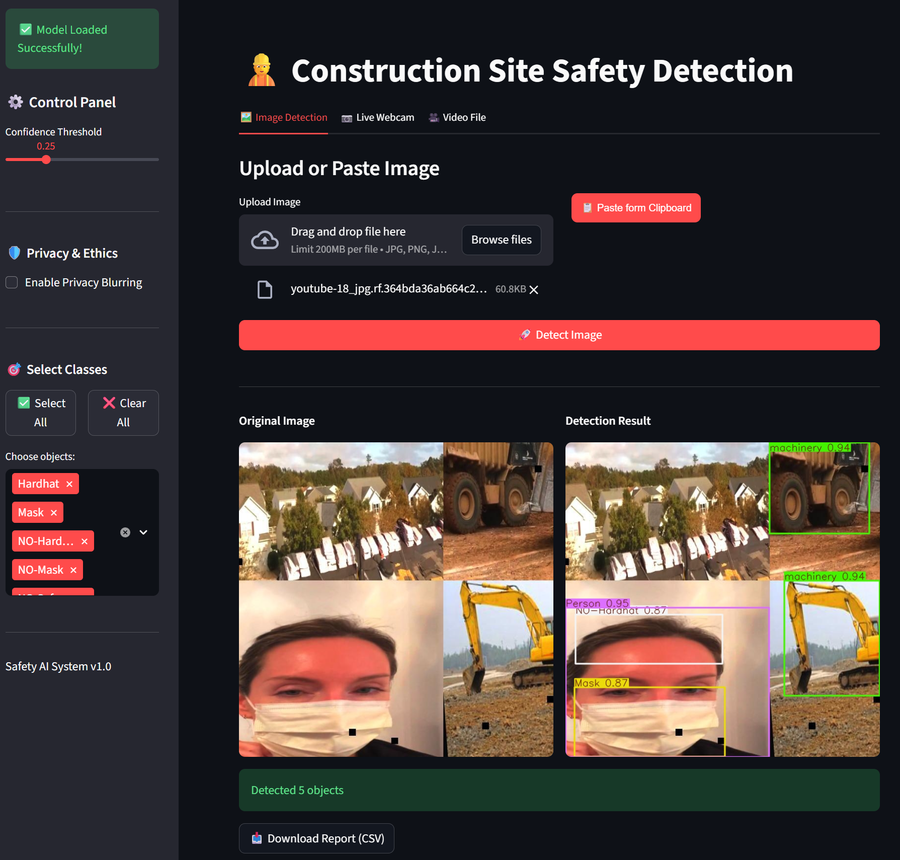

# Construction Site Safety Detection System


> **An AI-powered Computer Vision system designed to enhance workplace safety by detecting Personal Protective Equipment (PPE) compliance in real-time.**

---

## Table of Contents
- [Project Overview](#-project-overview)
- [Key Features](#-key-features)
- [Technology Stack](#-technology-stack)
- [Dataset & Model](#-dataset--model)
- [Installation & Setup](#-installation--setup)
- [Usage Guide](#-usage-guide)
- [Results](#-results)
- [Team Members](#-team-members)

---

## Project Overview
Safety in construction sites is a critical concern. This project leverages **Deep Learning (YOLOv8)** to monitor construction sites automatically. The system identifies workers, checks for essential safety gear (Hardhats, Vests, Masks), and flags violations in real-time through an interactive web interface.

The goal is to provide a "Safety Assistive Tool" that helps site managers reduce accidents and ensure compliance with safety regulations.

---

## Key Features
What makes this project unique:

### 1. Detection Capabilities 
- **10 Object Classes:** Detects `Hardhat`, `Safety Vest`, `Mask`, `Person`, `Machinery`, `Vehicle`, and critical violations like `NO-Hardhat`.
- **High Accuracy:** Optimized using Transfer Learning on the YOLOv8n architecture.

### 2. Smart Interface (Streamlit) 
- **Image Analysis:** Upload images or paste directly from the clipboard.
- **Video Support:** Process construction site footage (MP4/AVI) frame-by-frame.
- **Live Webcam:** Real-time snapshot analysis for demonstrations.

### 3. Ethical AI & Privacy 
- **Privacy Mode:** Built-in module to blur workers' faces automatically to protect identity while monitoring safety compliance.

### 4. Reporting & Analytics 
- **Data Logging:** Automatically generates a CSV report of all detected violations.
- **Class Filtering:** Users can filter detection to focus only on specific hazards (e.g., show only "No Hardhat").

---

## Technology Stack

| Component | Technology Used |
|-----------|----------------|
| **Core Model** | YOLOv8 (Ultralytics) |
| **Language** | Python 3.x |
| **Interface** | Streamlit |
| **Computer Vision** | OpenCV, PIL |
| **Data Handling** | Pandas, NumPy |
| **Training** | Google Colab (Tesla T4 GPU) |

---

## Dataset & Model
* **Source:** [Site Construction Safety Dataset](https://roboflow.com/) (Roboflow Universe).
* **Size:** Started with 2,777 images -> Augmented to **6,630 images** (3x augmentation factor).
* **Preprocessing:** Resized to 640x640, Auto-orientation.
* **Augmentation:** Horizontal Flip, Brightness (±15%) to simulate diverse weather/lighting conditions.
* **Test Set:** Evaluated on a strictly isolated test set of 287 images.

---

## Installation & Setup

Follow these steps to run the project locally:

1. **Clone the Repository**
   ```bash
   git clone https://github.com/AlAsiri-Ali/PPE-Safety-Detection.git
   cd PPE-Safety-Detection
   ```

2. **Install Dependencies**
   ```bash
   pip install -r requirements.txt
   ```

3. **Run the Application**
   ```bash
   streamlit run src/app.py
   ```

---

## Usage Guide

### Control Panel (Sidebar):
- Adjust the **Confidence Threshold** slider to filter weak detections.
- Enable **"Privacy Blurring"** to test the ethical AI feature.
- Use **"Select Classes"** to focus on specific objects.
> **Tip:** You can find sample images in the `demo_samples/` folder to test the application immediately.

### Tabs:
- **Image:** Paste or upload a photo to test.
- **Webcam:** Use for live demos (requires camera).
- **Video:** Upload a site monitoring video for analysis.

### Download Report:
After detection, click the **"Download CSV"** button to get the violation log.

---

## Results

Our model achieved high precision on the test set, balancing speed and accuracy for real-time deployment.

| Metric | Value | Interpretation |
|--------|-------|----------------|
| **mAP@50** | **80.2%** | High consistency in detection. |
| **Precision** | **89.3%** | Very low false positive rate (reliable alerts). |
| **Recall** | **71.7%** | Acceptable sensitivity for complex scenes. |

> **Key Insight:** The model demonstrates exceptional performance on distinct classes like Masks (94.1%) and Machinery (93.7%), while we identified future improvement areas for smaller objects like Safety Cones (66.2%).

### Confusion Matrix


### Detection Samples

